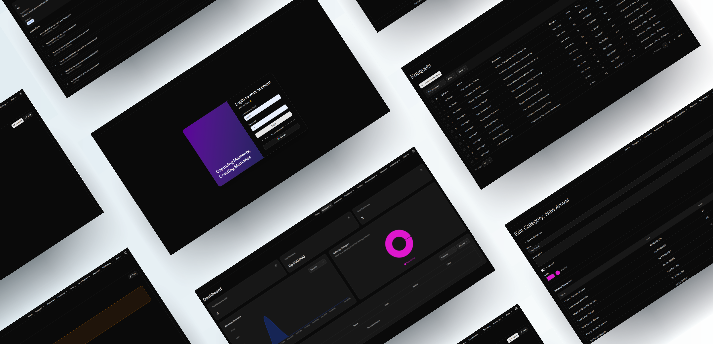

<p align="center">
  
</p>

<h1 align="center">SavirBlossom</h1>

<p align="center">
  <strong>Full-Stack E-Commerce Management Dashboard</strong>
  <br>
  A modern admin panel and REST API backend for managing a flower shop platform — built with Laravel & React.
</p>

<p align="center">
  
  
  
  
  
</p>

---

## About

SavirBlossom is a **feature-rich administration dashboard** and **headless API backend** designed for managing a flower shop e-commerce platform. It provides a complete toolset for handling products, customers, orders, marketing campaigns, and dynamic content — all through an intuitive single-page application.

Built as a professional portfolio project, it demonstrates modern full-stack development practices with a clean separation between a Laravel API backend and a React SPA frontend.

---

## Features

|                                                                                                               |                                                                                                               |                                                                                                          |
| ------------------------------------------------------------------------------------------------------------- | ------------------------------------------------------------------------------------------------------------- | -------------------------------------------------------------------------------------------------------- |
| **📊 Dashboard Analytics** — Real-time stats, revenue charts, category breakdowns, and ongoing order tracking | **💐 Bouquet Management** — Full CRUD with categories, image galleries, bulk operations, and publish controls | **👥 Customer Management** — Profiles, addresses, email verification, password setup flow, order history |
| **📦 Order Management** — Cart system, checkout, invoicing, status tracking, mark-as-paid                     | **🏷️ Coupons & Discounts** — Create and manage discount codes with validation and usage tracking              | **📝 Form Builder** — Dynamic forms with custom questions, option management, and submission collection  |
| **⭐ Feedback System** — Template-based question banks, response collection, and analytics                    | **📧 Newsletter** — Subscribe/unsubscribe flow, subscriber management with toggle activation                  | **📢 Promos & Campaigns** — Create promotions, queue email campaigns with send scheduling                |
| **🖼️ Gallery Management** — Per-bouquet image galleries with upload, reorder, and delete                      | **🔐 Authentication** — Sanctum token auth, Google OAuth, password setup/reset, email verification            | **🌐 REST API** — 116+ endpoints across 20 modules, documented Postman collection                        |

---

## Tech Stack

| Frontend                                   | Backend                              |
| ------------------------------------------ | ------------------------------------ |
| **React 19** with TypeScript               | **Laravel 12** with PHP 8.2          |
| **Vite 7** build tool                      | **Laravel Sanctum** (token auth)     |
| **Tailwind CSS 4** styling                 | **Laravel Socialite** (Google OAuth) |
| **TanStack Query 5** (server state)        | **SQLite / MySQL / PostgreSQL**      |
| **TanStack Table 8** (data tables)         | **Redis** (optional cache/queue)     |
| **React Router 7** (routing)               | **Laravel Queue** (background jobs)  |
| **React Hook Form + Zod** (forms)          |                                      |
| **Recharts** (charts)                      |                                      |
| **shadcn/ui** (60+ Radix-based components) |                                      |

---

## Architecture

```
┌──────────────────────┐         ┌──────────────────────┐         ┌──────────┐
│   React SPA (Vite)   │  HTTP   │   Laravel REST API   │  ORM    │ Database │
│   resources/js/      │ ◄─────► │   routes/api.php     │ ◄─────► │   MySQL  │
│   TanStack Query     │  JSON   │   Controllers / Services │      │  SQLite  │
│                      │  Auth   │   Sanctum Middleware  │         │          │
└──────────────────────┘         └──────────────────────┘         └──────────┘
```

- **SPA Frontend** communicates exclusively via JSON API calls
- **Token-based authentication** using Laravel Sanctum
- **Queue workers** handle email sending and campaign dispatch
- **24 Eloquent models** powering 47 database tables with 47 migrations

---

## Screenshots

<p align="center">
  
  <br>
  <em>Dashboard — analytics overview with revenue chart, category breakdown, and ongoing orders</em>
</p>

---

## Quick Start

### Prerequisites

- PHP 8.2+
- Node.js 20+
- Composer
- npm

### Setup

```bash
# One-command setup (installs deps, sets up .env, generates key, migrates, builds frontend)
composer setup

# Start development (PHP server + queue worker + logs + Vite concurrently)
composer dev
```

### Manual Setup

<details>
<summary>Click to expand</summary>

```bash
# Install PHP dependencies
composer install

# Environment setup
cp .env.example .env
php artisan key:generate

# Database (defaults to SQLite)
php artisan migrate

# Install and build frontend
npm install
npm run build

# Start development servers
composer dev
```

</details>

### Run Tests

```bash
composer test
```

---

## Environment

Key environment variables (see `.env.example` for full list):

| Variable           | Description                                                                    |
| ------------------ | ------------------------------------------------------------------------------ |
| `DB_CONNECTION`    | `sqlite` (default) or `mysql`                                                  |
| `APP_FRONTEND_URL` | Frontend URL for password reset/setup links (default: `http://localhost:5173`) |
| `MAIL_MAILER`      | Mail driver (Mailtrap SMTP configured for development)                         |

---

## API Documentation

A complete **Postman collection** with 116+ endpoints across 20 modules is available in the [`API-DOCS/`](./API-DOCS) directory.

- [Latest Collection](./API-DOCS/Latest/SavirBlossom-API.postman_collection.json)
- [Changelog](./API-DOCS/CHANGELOG.md)

---

## License

This project is open-sourced under the [MIT license](./LICENSE).
